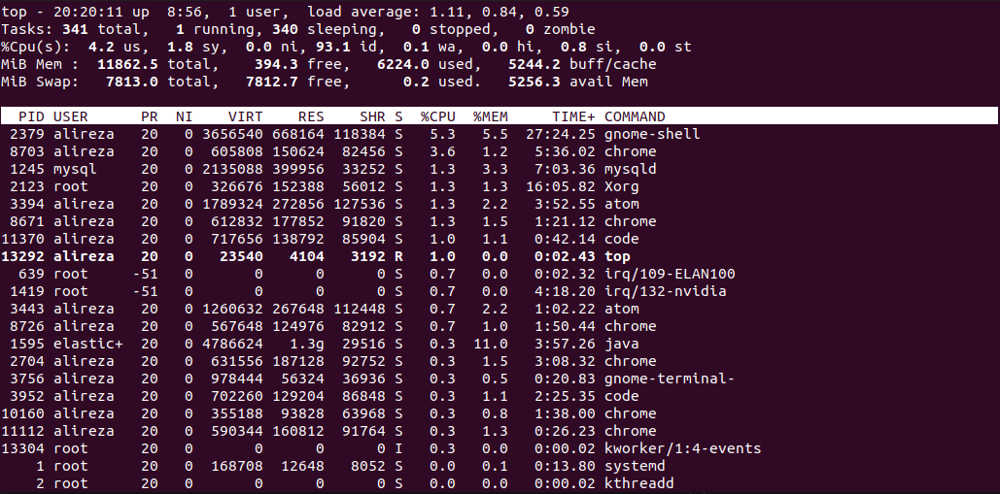
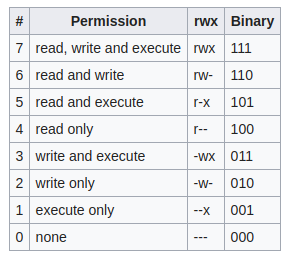
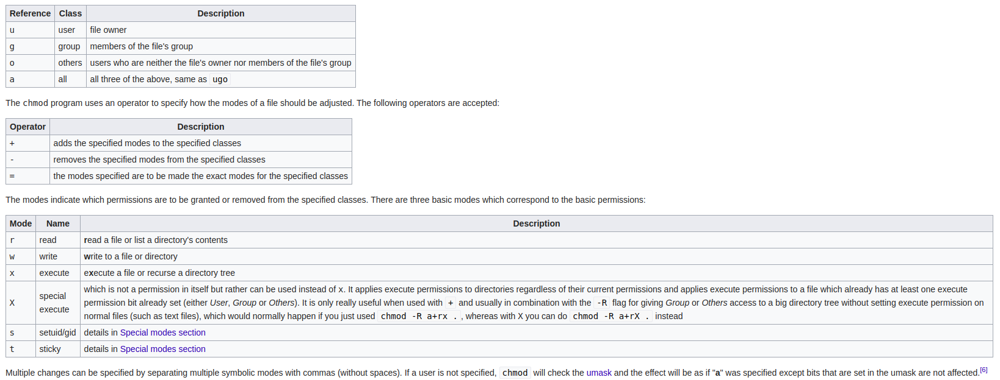

# Commands  : Series 3

<div dir="rtl" markdown="1">
گزارش کار سوم :‌
<div dir="ltr" markdown="1">

* **[ps](#ps) :**
  * [ax](#psax)
  * [axu](#psaxu)

* **[pstree](#pstree)**

* **[alias](#alias)**

* **[ll](#ll)**

* **[top](#top)**

* **[kill](#kill)**

* **[free](#free)**

* **[systemctl](#systemctl)**

* **[chmod](#chmod)**

* **[chown](#chown)**

* **[chgrp](#chgrp)**


## ps

<div dir="rtl" markdown="1">
نمایش پروسس های فعال بر روی شل فعلی
<div dir="ltr" markdown="1">

```linux
➜  ~ ps
 PID  TTY      TIME CMD
 3767 pts/1    00:00:00 zsh
 3790 pts/1    00:00:00 ps
```

### psax

<div dir="rtl" markdown="1">
نمایش خروجی به صورت BSD
<div dir="ltr" markdown="1">

```linux
➜  ~ ps ax
  PID TTY      STAT   TIME COMMAND
    1 ?        Ss     0:08 /sbin/init splash
    2 ?        S      0:00 [kthreadd]
    3 ?        I<     0:00 [rcu_gp]
    4 ?        I<     0:00 [rcu_par_gp]
    6 ?        I<     0:00 [kworker/0:0H-kblockd]
    9 ?        I<     0:00 [mm_percpu_wq]
   10 ?        S      0:00 [ksoftirqd/0]
   11 ?        I      0:27 [rcu_sched]
   12 ?        S      0:00 [migration/0]
   13 ?        S      0:00 [idle_inject/0]
   14 ?        S      0:00 [cpuhp/0]
 ...
```

### psaxu

<div dir="rtl" markdown="1">
علاوه بر مشخصات سوییچ قبلی میزان استفاده هر پروسه از منابع رو در لحظه اجرای دستور به همراه یوزر آن پروسه نشان میدهد.
<div dir="ltr" markdown="1">

```linux
➜  ~ ps axu
USER       PID %CPU %MEM    VSZ   RSS TTY      STAT START   TIME COMMAND
root         1  0.0  0.0 167512 11348 ?        Ss   11:23   0:08 /sbin/init spla
root         2  0.0  0.0      0     0 ?        S    11:23   0:00 [kthreadd]
root         3  0.0  0.0      0     0 ?        I<   11:23   0:00 [rcu_gp]
root         4  0.0  0.0      0     0 ?        I<   11:23   0:00 [rcu_par_gp]
root         6  0.0  0.0      0     0 ?        I<   11:23   0:00 [kworker/0:0H-k
root         9  0.0  0.0      0     0 ?        I<   11:23   0:00 [mm_percpu_wq]
root        10  0.0  0.0      0     0 ?        S    11:23   0:00 [ksoftirqd/0]
root        11  0.1  0.0      0     0 ?        I    11:23   0:27 [rcu_sched]
root        12  0.0  0.0      0     0 ?        S    11:23   0:00 [migration/0]
root        13  0.0  0.0      0     0 ?        S    11:23   0:00 [idle_inject/0]
root        14  0.0  0.0      0     0 ?        S    11:23   0:00 [cpuhp/0]
root        15  0.0  0.0      0     0 ?        S    11:23   0:00 [cpuhp/1]
root        16  0.0  0.0      0     0 ?        S    11:23   0:00 [idle_inject/1]
root        17  0.0  0.0      0     0 ?        S    11:23   0:00 [migration/1]
root        18  0.0  0.0      0     0 ?        S    11:23   0:00 [ksoftirqd/1]
root        20  0.0  0.0      0     0 ?        I<   11:23   0:00 [kworker/1:0H-k
root        21  0.0  0.0      0     0 ?        S    11:23   0:00 [cpuhp/2]
root        22  0.0  0.0      0     0 ?        S    11:23   0:00 [idle_inject/2]
...
```

## pstree

<div dir="rtl" markdown="1">
نمایش لیست پروسه های فعال به صورت درختی (پروسه های پدر در ریشه و فرزندان در شاخه ها)
<div dir="ltr" markdown="1">

```
pstree 
systemd─┬─ModemManager───2*[{ModemManager}]
        ├─NetworkManager───2*[{NetworkManager}]
        ├─accounts-daemon───2*[{accounts-daemon}]
        ├─acpid
        ├─avahi-daemon───avahi-daemon
        ├─blkmapd
        ├─bluetoothd
        ├─boltd───2*[{boltd}]
        ├─colord───2*[{colord}]
        ├─cron
        ├─cups-browsed───2*[{cups-browsed}]
        ├─cupsd───dbus
        ├─dbus-daemon
        ├─gdm3─┬─gdm-session-wor─┬─gdm-x-session─┬─Xorg───{Xorg}
        │      │                 │               ├─gnome-session-b───3*[{gnome-+
        │      │                 │               └─2*[{gdm-x-session}]
        │      │                 └─2*[{gdm-session-wor}]
        │      ├─gdm-session-wor─┬─gdm-x-session─┬─Xorg───{Xorg}
        │      │                 │               ├─gnome-session-b─┬─ssh-agent
        │      │                 │               │                 └─2*[{gnome-+
        │      │                 │               └─2*[{gdm-x-session}]
        │      │                 └─2*[{gdm-session-wor}]
        │      └─2*[{gdm3}]
```

## alias

<div dir="rtl" markdown="1">
تعریف نام مستعار برای دستورات. به صورت عادی لیست مستعار ها رو پیشفرض ها را نمایش میدهد.
تعریف alias برای دستورات در حالت عادی مدت زمان قابل استفاده بودن این نام های جایگزین تا باز بودن شل است 

<div dir="ltr" markdown="1">

**Syntax**

`alias new_name="your custom command here"`

<div dir="rtl" markdown="1">
برای ذخیره دایمی دستورات نیاز است تا فایل زیر را با یک ویرایش گر ویرایش کرد : 
<div dir="ltr" markdown="1">

`nano ~/.bashrc`

<div dir="rtl" markdown="1">
برای حذف یک نام مستعار از دستور زیر استفاده میکنیم  :‌
<div dir="ltr" markdown="1">

`$ unalias alias_name`

`$ unalias -a [remove all alias]`

## ll

<div dir="rtl" markdown="1">
یکی از  alias های پیشفرض است : 
<div dir="ltr" markdown="1">

‍‍‍`ll='ls -lh'`

## top


<div dir="rtl" markdown="1">
نمایش لیست پروسه های فعال به همراه میزان منابع استفاده شده و PEID آن . این نمایش  به صورت real time است بر خلاف ps
<div dir="ltr" markdown="1">



## kill

<div dir="rtl" markdown="1">
بستن پروسه ها با استفاده از این دستور امکان پذیر است . برای بستن نیاز است که PEID پروسه را داشته باشیم . برای بدست آوردن آن میتوانیم از دستور top استفاده کنیم .
<div dir="ltr" markdown="1">

`kill [PEID]`

```linux
➜  ~ kill 3394
```

## free

<div dir="rtl" markdown="1">
نمایش میزان فضا ( خالی و استفاده شده ) در RAM و حافظه Swap
<div dir="ltr" markdown="1">


```linux
➜  ~ free -h
              total        used        free      shared  buff/cache   available
Mem:           11Gi       6.0Gi       443Mi       160Mi       5.1Gi       5.2Gi
Swap:         7.6Gi       0.0Ki       7.6Gi
```

* `total` - This number represents the total amount of memory that can be used by the applications.
* `used` - Used memory. It is calculated as: used = total - free - buffers - cache
* `free` - Free / Unused memory.
* `shared` - This column can be ignored as it has no meaning. It is here only for backward compatibility.
* `buff/cache` - The combined memory used by the kernel buffers and page cache and slabs. /this memory can be reclaimed at any time if needed by the applications. If you want buffers and cache to be displayed in two separate columns use the -w option.
* `available` - An estimate of the amount of memory that is available for starting new applications, without swapping.


## systemctl

<div dir="rtl" markdown="1">
یک ابزار برای کنترل سرویس ها . جایگزینی برای SysV . در نسل جدید 
سیستم های عامل لینوکسی وجود دارد . 
<div dir="ltr" markdown="1">

 Some Switches : 

* `start`: To start stopped service

* `stop`: To stop running service

* `enable`: Used to enable service to start on system boot

* `disable`: Used to disable service to not to start on system boot

* `is-active`: Used to check if service current service status

* `is-enabled`: Used to check if service is enabled to start on system boot

* `status`: Used to check current status of a service

* `Reload`: Used to reload configuration of a running service.

* `restart`: Used to restart (Stop/Start) a running service
reload-or-restart: Used to reload a service default, but if reload is not available for that service. It will restart it

## chmod: 
<div dir="rtl" markdown="1">
با استفاده از این دستور میتوان سطح دسترسی فایل را تغییر داد
<div dir="ltr" markdown="1">

**Syntax :**

`chmod [references][operator][modes] <file> `

**Numerical permissions :**

The chmod numerical format accepts up to four octal digits. The three rightmost digits define permissions for the file user, the group, and others. The optional leading digit, when 4 digits are given, specifies the special setuid, setgid, and sticky flags. Each digit of the three rightmost digits represents a binary value, which controls the "read", "write" and "execute" permissions respectively. A value of 1 means a class is allowed that action, while a 0 means it is disallowed.



**Symbolic modes:**

The chmod command also accepts a finer-grained symbolic notation,[5] which allows modifying specific modes while leaving other modes untouched. The symbolic mode is composed of three components, which are combined to form a single string of text.




## chown: 
<div dir="rtl" markdown="1">
با استفاده از این دستور میتوان مالک فایل را تغییر داد برای این کار باید سطح دسترسی بیشتر از مالک داشت
<div dir="ltr" markdown="1">

**Syntax :**

`
chown [option] [owner][:[group]] <file>
`

```linux
sudo chown root os_lab.txt
```

## chgrp: 
<div dir="rtl" markdown="1">
تغییر گروه فایل ها 
برای تغییر گروه فایل های یک پوشه باید از سوییچی R- استفاده کرد
<div dir="ltr" markdown="1">

**Syntax :**

`chgrp [group] <file>`

```linux
➜  ~ sudo chgrp root os_lab.txt   
➜  ~ sudo chgrp -R root os_lab 
```
